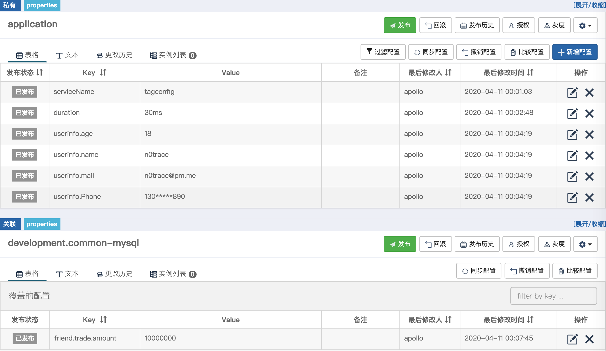

# tagconfig

## 功能

tagconfig 支持根据tag解析嵌套的扁平化的配置, 您只需要实现以下interface即可接入您的配置平台，本项目实现了apollo配置的接入，本项目不拉取配置，只负责将您拉取的配置解析到结构体。

```golang
ConfigProvider interface {
	Paires() ([]Paire, error)
	FieldInfo(field reflect.StructField) (namespace string, key string)
}
```

## Apollo 用法

```go
import (
	"github.com/shima-park/agollo"
	"github.com/n0trace/tagconfig"
	"github.com/n0trace/tagconfig/apollo"
)
//配置结构体
config := new(Config)

//new一个agollo客户端(第三方)
c, _ := agollo.New(configServerURL, appid, opts...)

//用第三方客户端初始化一个 tagconfig provider
client := apollo.NewClient(c, appid, []string{"application", "development.common-mysql"})

//获得一个apollo配置解析器
decoder := tagconfig.NewDecoder(client)

//把配置解析到config
err := decoder.Decode(&config)
```

### example

这个例子可以帮您快速上手该项目，比如我们的配置是如下一个结构体。

```golang
type Config struct {
	ServiceName string 
	Duration    Duration 
	UserInfo    struct {
		Name  string
		Age   int64 
		Email string 
		Phone string
	} 
	Friend struct {
		Trade struct {
			Amount float64
		} 
	}
}
```
如果`Friend`字段是在一个公共的namespace,那么我们在apollo上的配置会类似下图



这时候我们只要在结构中像json那样申明tag即可，如下所示:

```golang
type Config struct {
	ServiceName string   `apollo:"serviceName"`
	Duration    Duration `apollo:"duration"`
	UserInfo    struct {
		Name  string `apollo:"name"`
		Age   int64  `apollo:"age"`
		Email string `apollo:"email"`
		Phone string
	} `apollo:"userinfo"`
	Friend struct {
		Trade struct {
			Amount float64 `apollo:"amount"`
		} `apollo:"trade"`
	} `apollo:"development.common-mysql:friend"`
}
```

完整代码参考[example](/example)

> 注意事项

1.当子结构为slice或是map,会当作json解析,后续会支持tagconfig选项支持更多灵活的配置

## 自定义解析器

如果需要特殊解析，实现下面的方法即可

```go
type Config struct{
    Foo struct{
        Bar string
    }
}
func (foo *Foo)UnmarshalTagConfig(m map[string]string) (err error) {
    //m是一个map
    //m["."]可以匹配到apollo设置为Config.Foo的kv
    //m["Bar"]可以匹配到apollo设置为Config.Foo.Bar的kv
}
```
